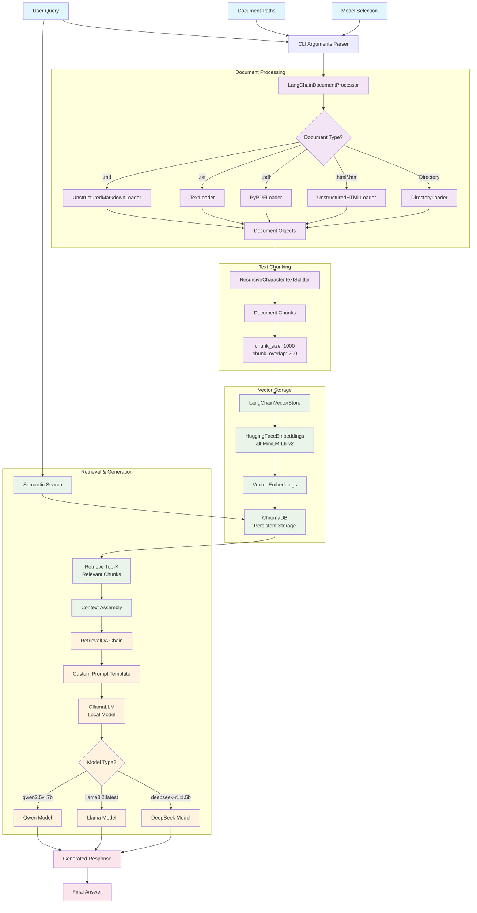

# LangChain RAG System Flow Diagram

## Key Components:

1. **Document Processing**: LangChain loaders handle multiple file formats
2. **Text Splitting**: Recursive character splitter with configurable chunk size/overlap
3. **Vector Storage**: HuggingFace embeddings with ChromaDB persistence
4. **Retrieval**: Semantic search for relevant context
5. **Generation**: Ollama LLM with RetrievalQA chain and custom prompts

## Data Flow:

- Documents → Chunks → Vectors → Storage
- Query → Search → Context → LLM → Response
- All components use LangChain abstractions for modularity